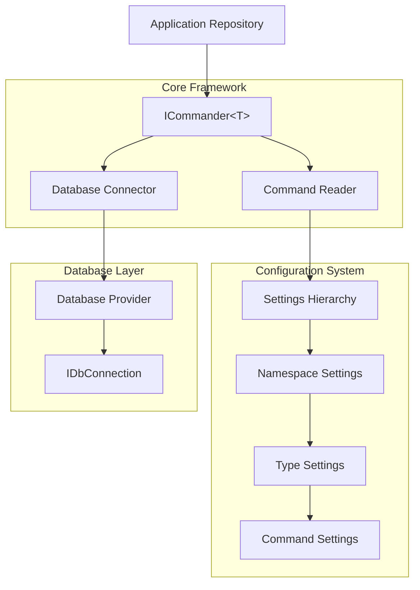
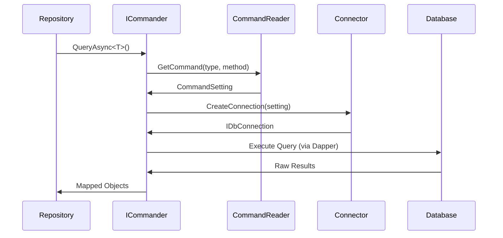
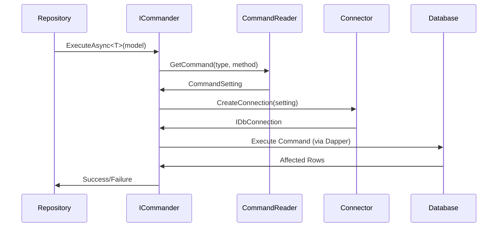

# Syrx Architecture

This document provides a comprehensive overview of the Syrx framework architecture, its core components, and design principles.

## Table of Contents

- [Overview](#overview)
- [Core Architecture Principles](#core-architecture-principles)
- [Component Architecture](#component-architecture)
- [Framework Flow](#framework-flow)
- [Extension Points](#extension-points)
- [Configuration Architecture](#configuration-architecture)
- [Database Provider Architecture](#database-provider-architecture)
- [Thread Safety and Performance](#thread-safety-and-performance)

## Overview

Syrx is designed as a lightweight, database-agnostic data access framework built on top of Dapper. Its architecture emphasizes separation of concerns, extensibility, and performance while providing a clean abstraction layer that decouples application code from specific database implementations.

## Core Architecture Principles

### 1. **Separation of Concerns**
- **Repository Layer**: Business logic remains database-agnostic
- **Configuration Layer**: SQL commands and database-specific settings are externalized
- **Connection Layer**: Database connectivity is abstracted through providers
- **Command Resolution**: Method-to-SQL mapping is handled transparently

### 2. **Dependency Inversion**
- Application code depends on abstractions (`ICommander<T>`, `IConnector<T>`)
- Concrete implementations are provided by database-specific providers
- Configuration is injected through dependency injection

### 3. **Open/Closed Principle**
- Framework is closed for modification but open for extension
- New database providers can be added without changing core framework
- Custom readers and connectors can be implemented

### 4. **Single Responsibility**
- Each component has a focused responsibility
- Clear boundaries between configuration, connection, and execution concerns

## Component Architecture



### Core Components

#### **ICommander&lt;TRepository&gt;**
- **Purpose**: Primary interface for all data access operations
- **Responsibilities**: 
  - Method name resolution via `[CallerMemberName]`
  - Parameter handling and validation
  - Transaction coordination
  - Exception management
- **Design**: Generic interface providing type safety and method resolution

#### **ICommandReader&lt;TCommandSetting&gt;**
- **Purpose**: Resolves method calls to command configurations
- **Responsibilities**:
  - Type and method name resolution
  - Command setting retrieval
  - Caching (implementation-dependent)
- **Design**: Generic interface supporting different setting types

#### **IConnector&lt;TConnection, TCommandSetting&gt;**
- **Purpose**: Abstracts database connection creation
- **Responsibilities**:
  - Connection string management
  - Connection lifecycle
  - Database-specific connection configuration
- **Design**: Generic interface supporting various connection types

#### **Settings Hierarchy**
- **ISettings&lt;TCommandSetting&gt;**: Root settings container
- **INamespaceSetting&lt;TCommandSetting&gt;**: Namespace-level grouping
- **ITypeSetting&lt;TCommandSetting&gt;**: Type-level configuration
- **ICommandSetting**: Base command configuration

## Framework Flow

### Query Operation Flow



### Execute Operation Flow



## Extension Points

### 1. **Database Providers**
- Implement `IConnector<IDbConnection, TCommandSetting>`
- Provide database-specific connection logic
- Handle connection string formats and options

### 2. **Command Readers**
- Implement `ICommandReader<TCommandSetting>`
- Support different configuration sources (JSON, XML, Database, etc.)
- Provide caching strategies

### 3. **Settings Implementations**
- Extend `ICommandSetting` for database-specific requirements
- Add provider-specific properties (timeouts, isolation levels, etc.)

### 4. **Service Registration Extensions**
- Extend `SyrxBuilder` for fluent configuration
- Provide database-specific registration methods

## Configuration Architecture

### Hierarchical Configuration Model

```
ISettings<TCommandSetting>
├── Namespaces[]
    ├── Types[]
        ├── Commands[methodName]
            ├── ConnectionString/Alias
            ├── CommandText (SQL)
            ├── CommandType
            ├── Timeout
            └── Provider-specific settings
```

### Configuration Resolution Strategy

1. **Method Resolution**: `[CallerMemberName]` attribute captures calling method
2. **Type Resolution**: Generic `ICommander<TRepository>` provides type information
3. **Namespace Resolution**: Full namespace from type information
4. **Command Lookup**: Hierarchical lookup: Namespace → Type → Method → Command

### Configuration Precedence

1. **Method-specific settings**: Exact method name match
2. **Type-level defaults**: Fallback to type-level configuration
3. **Namespace defaults**: Further fallback to namespace-level settings
4. **Global defaults**: System-wide default settings

## Database Provider Architecture

### Provider Registration Pattern

```csharp
public static class SqlServerExtensions
{
    public static SyrxBuilder UseSqlServer(this SyrxBuilder builder, 
        Action<SqlServerBuilder> configure)
    {
        // Register SQL Server-specific services
        builder.ServiceCollection.AddTransient<IConnector<IDbConnection, SqlServerCommandSetting>, 
            SqlServerConnector>();
        builder.ServiceCollection.AddTransient<ICommandReader<SqlServerCommandSetting>, 
            SqlServerCommandReader>();
        
        var sqlServerBuilder = new SqlServerBuilder(builder.ServiceCollection);
        configure(sqlServerBuilder);
        
        return builder;
    }
}
```

## Thread Safety and Performance

### Thread Safety

- **ICommander**: Implementations must be thread-safe
- **ICommandReader**: Should support concurrent access with appropriate caching
- **IConnector**: Connection creation should be thread-safe
- **Settings**: Immutable after configuration completes

### Performance Considerations

- **Connection Management**: Leverage connection pooling provided by ADO.NET providers
- **Command Caching**: Cache parsed commands to avoid repeated resolution
- **Lazy Loading**: Defer expensive operations until needed
- **Memory Efficiency**: Minimize object allocation in hot paths

### Caching Strategy

```csharp
public class CachedCommandReader<TCommandSetting> : ICommandReader<TCommandSetting>
    where TCommandSetting : ICommandSetting
{
    private readonly ConcurrentDictionary<string, TCommandSetting> _cache;
    private readonly ICommandReader<TCommandSetting> _innerReader;
    
    public TCommandSetting GetCommand(Type type, string method)
    {
        var key = $"{type.FullName}.{method}";
        return _cache.GetOrAdd(key, _ => _innerReader.GetCommand(type, method));
    }
}
```

## Best Practices for Extension Development

### 1. **Follow Naming Conventions**
- Use consistent naming for providers (e.g., `Syrx.SqlServer`, `Syrx.MySql`)
- Extension methods should follow pattern: `Use{Provider}Name`

### 2. **Implement Complete Provider Support**
- Provide both base provider and extensions packages
- Include comprehensive configuration builders
- Support connection string and direct connection configuration

### 3. **Handle Provider-Specific Features**
- Expose database-specific options through command settings
- Provide typed builders for configuration
- Document provider-specific behavior and limitations

### 4. **Testing Strategy**
- Unit tests for configuration and connection logic
- Integration tests with actual database providers
- Performance benchmarks against raw ADO.NET

### 5. **Documentation Requirements**
- Provider-specific README files
- Configuration examples
- Migration guides from raw ADO.NET or other ORMs

This architecture enables Syrx to provide a consistent, high-performance data access layer while maintaining flexibility for different database providers and use cases.